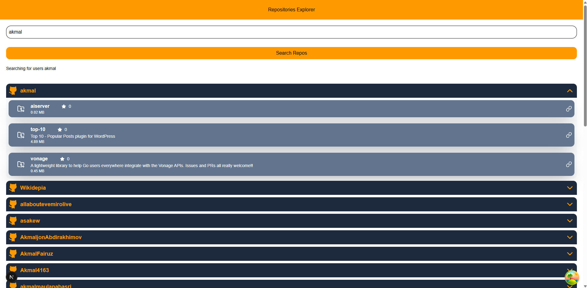

# 🚀 GitHub Repositories Explorer

A modern React + TypeScript application that lets users search for GitHub usernames and view all repositories for a selected user. Built using React Query, Axios, and the GitHub REST API.

---

## 📸 Preview


---

## 🧰 Tech Stack

- ⚛️ React 19 + Next.js (App Router)
- 🧠 TypeScript
- 🗂 React Query (TanStack Query)
- 📡 Axios for API calls
- 💨 TailwindCSS
- 🌐 GitHub REST API v3
- 🔒 .env for environment variables

---

## 🧪 Features

- 🔍 Search up GitHub usernames matching input
- 📁 Click a user to fetch their public repositories
- 🚀 Reusable `useApiQuery` / `useApiMutation` hooks (useApiMutation didn't used)
- 🌐 Fully typed with TypeScript
- ⚙️ Error & loading state handling
- ♿ Keyboard accessible input
- 🔐 Token-based authorization (if provided)

---

## 📦 Getting Started

### 1. Clone the repo

```bash
git clone https://github.com/your-username/github-repositories-explorer.git
cd github-repositories-explorer
```

### 2. Create file .env or .env. with copy and paste the contents

```bash
cp .env.example .env.local
```

### 3. Token-based Authorization (Optional, Recommended to Avoid Rate Limits)

If you want to avoidrate limits, you need to generate your github token https://github.com/settings/tokens and put it in file .env.local or .env
```env
NEXT_PUBLIC_BASE_URL=https://api.github.com
NEXT_PUBLIC_GITHUB_TOKEN=YOUR TOKEN GITHUB | #PASTE YOUR TOKEN GITHUB FOR MORE LIMITTED ACCESS
```

But its optional, because I implemented a logic on headers Authorization to handle TOKEN GITHUB.

### 4. Run the app

```bash
yarn dev
npm run dev
```


🌍 Live Demo
https://repo-explorer-akmallmr.vercel.app/
Deployed on Vercel

Made by akmallmr, reach me on:

✉️ akmallmr@gmail.com
🖥️ https://www.linkedin.com/in/akmalmr/